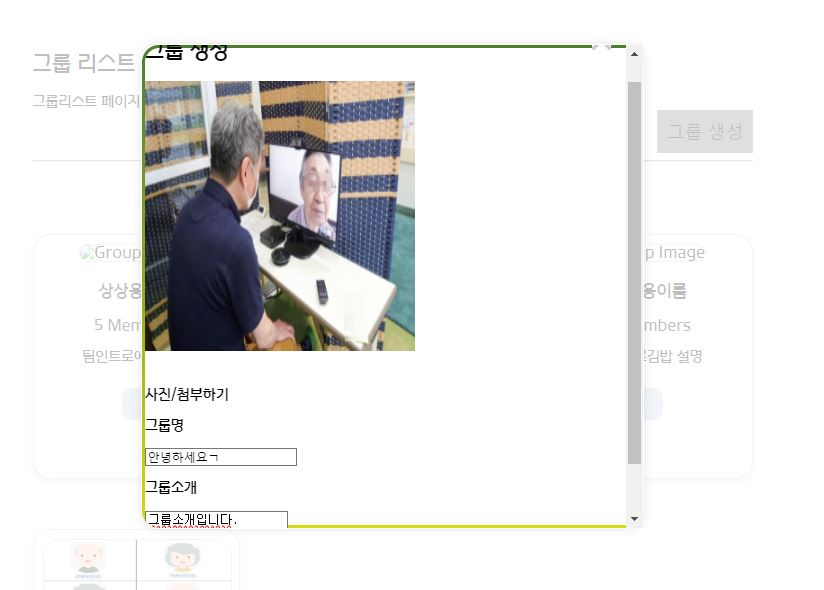
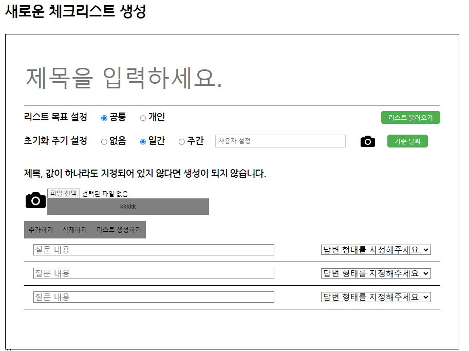
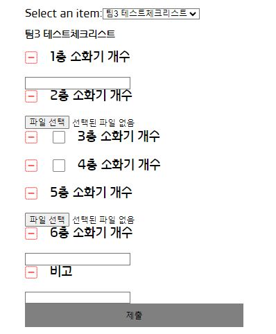

# SAFEROUTINE

------------

## 중소규모 시설을 위한 안전관리 웹사이트

## 목차
1. 개요
2. 개발 환경
3. 주요 기능
4. 설계 문서
5. 팀원 소개

## 개요

| 서비스명       | SAFEROUTINE                                                                                                                 |
|------------|-----------------------------------------------------------------------------------------------------------------------------|
| 개발 의도      | 기존의 아날로그 체크리스트의 불편함을 완화하기 위해 제작                                                                                             |
| 주요 이용자     | 점검 기록의 디지털화가 필요하나 솔루션 등을 구매하기 곤란한 소규모 업장 대학원 랩실 등 소속 기관 규정에 맞춘 안전기록 디지털화가 필요한 곳                                          |
| 해결하고 싶은 문제 | 수기 기록들이 아날로그로 쌓여 장부 열람이  어려운 문제 아날로그 기록 조작 방지                                                                         |
| 해결 방법      | OCR 기능 제공을 통한 기존 장부 디지털화 및 통계시각화   사진 기록을 통한 더욱 정확한 안전 관리                                                                |
| 서비스 가치     | 관리자의 편의성 상승                                                                                                                 |
| 핵심 기능      | OCR을 통한 서류 디지털화, 템플릿 생성                                                   |

## 개발 환경

매니지먼트 툴  
JIRA GITLAB GERRIT MATTERMOST NOTION FIGMA

IDE  
VSCODE INTELLIJ

INFRA  
AWS EC2 NGINX UBUNTU

FRONTEND  
HTML5 SCSS TYPESCRIPT REACT VITE AXIOS

BACKEND  
JAVA SPRING BOOT SPRING JPA JWT AWS S3 MYSQL MONGODB

## 주요 기능

<h3>그룹 생성</h3>

- 그룹 이름과 소개, 이미지를 통해 그룹 생성이 가능합니다.

  

<h3>체크리스트 생성</h3>

- 여러개의 질문으로 된 체크리스트를 생성할 수 있습니다. 

- 이미 생성된 체크리스트를 불러오거나 카메라 아이콘을 통해 OCR 기능을 사용해서 질문 리스트를 가져올 수 있습니다. 

- 리스트 목표를 통해 체크리스트를 그룹원 또는 본인만 사용할 수 있습니다.
- 체크리스트에 입력한 데이터를 초기화하는 주기를 정할 수 있습니다.

  

<h3>체크리스트 제출</h3>

- 작성할 체크리스트를 선택해서 작성한 후 제출할 수 있습니다.
- 답변의 형식은 텍스트, 체크박스, 사진 첨부 형태가 있습니다.

## 설계 문서

API 명세서 :
https://pinnate-knot-655.notion.site/API-41e23b55e50d4a8bab313226d201b5a8

ERD : https://pinnate-knot-655.notion.site/ERD-1b2ab011ac594153b15289d0ad1fb3ca

## 팀원 소개

BackEnd : 김진우, 류진호, 최홍준  
FrontEnd : 강보훈, 주동현, 이현정
